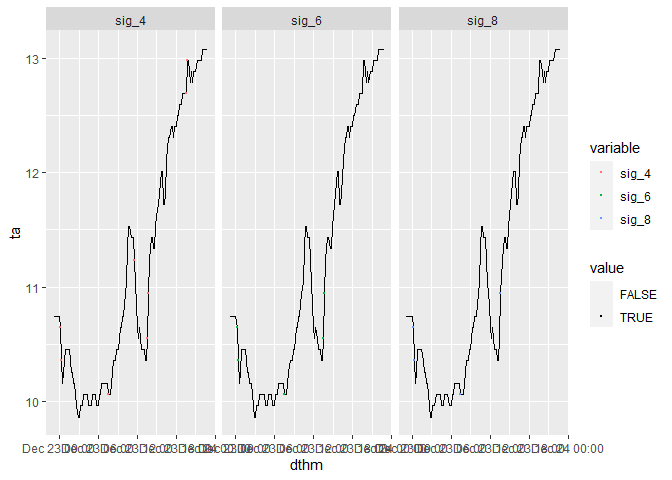
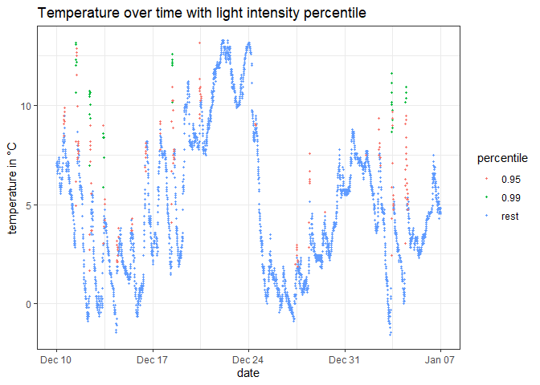
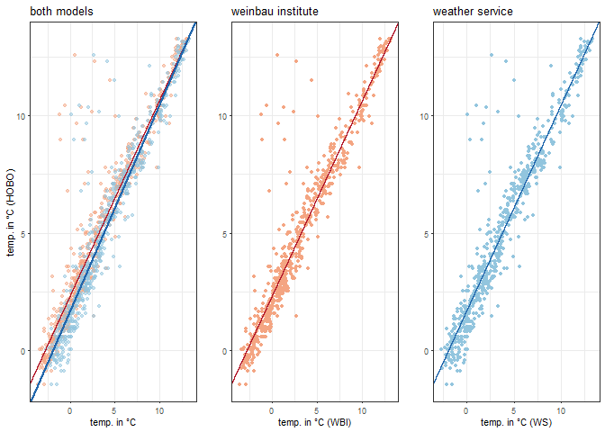

Quality control and Quality assurance for climate data
================
Ifeanyi Nwasolu
13/11/2021

This RMarkdown report shows the complete code to compute hourly quality
control for temperature indices. The first step is to download the data
from HOBO 10347392 and cut the series to the correct interval. Next, a
helper function is created to get the date, hour, and minute time stamp.

    ## Parsed with column specification:
    ## cols(
    ##   id = col_double(),
    ##   date = col_date(format = ""),
    ##   hm = col_time(format = ""),
    ##   ta = col_double(),
    ##   lux = col_double()
    ## )

    ## # A tibble: 4,032 x 6
    ##       id date       hm        ta   lux dthm               
    ##    <dbl> <date>     <drtn> <dbl> <dbl> <dttm>             
    ##  1     1 2018-12-10 00:00   7.08     0 2018-12-10 00:00:00
    ##  2     2 2018-12-10 00:10   7.08     0 2018-12-10 00:10:00
    ##  3     3 2018-12-10 00:20   6.98     0 2018-12-10 00:20:00
    ##  4     4 2018-12-10 00:30   7.08     0 2018-12-10 00:30:00
    ##  5     5 2018-12-10 00:40   6.98     0 2018-12-10 00:40:00
    ##  6     6 2018-12-10 00:50   6.98     0 2018-12-10 00:50:00
    ##  7     7 2018-12-10 01:00   7.08     0 2018-12-10 01:00:00
    ##  8     8 2018-12-10 01:10   7.08     0 2018-12-10 01:10:00
    ##  9     9 2018-12-10 01:20   7.18     0 2018-12-10 01:20:00
    ## 10    10 2018-12-10 01:30   7.08     0 2018-12-10 01:30:00
    ## # ... with 4,022 more rows

## Quality Control

In this section, quality control checks are implemented for weather
data. functions returning a boolean vector are created, where TRUE means
the respective point failed the check. The idea here is that sum up the
fails for each point can be used later on.

#### Measurement range (Plausible values)

The first check, i.e., the temperature must be between \(-20\text{°}C\)
and \(-70\text{°}C\), the light intensity between 0 and 320000 lux.

#### 1.2 Plausible rate of change

The next check returns `TRUE` if the change between two neighboring
points is unreasonably large.

#### 1.3 Minimum variability (Persistence)

This check returns `TRUE` if values do not change within the last 60
minutes. To account for floating point rounding errors, we check if the
variance of the last 60 minutes is smaller than a given tolerance.

#### 1.4 Maximum variability (Consistency)

This check returns `TRUE` if the difference between a point and its
neighbors is larger than eight times the standard deviation \(\sigma\)
of the temperatur of the last hour. One of the downsides of this check
is that it only considers the variance of the past hour and not the
future, which results e.g. in points being flagged after sunrise. To
counteract this, we chose \(8\sigma\) over \(4\sigma\) to reduce the
number of reasonable points that are flagged.

    ## Warning: Using alpha for a discrete variable is not advised.

<!-- -->

#### 1.5 Light intensity

This check flags points with high light intensity as their temperature
value might be influenced by direct radiation. For this, we compute the
\(0.95^\text{th}\) percentile of the light intensity (5511.1 Lux) and
the \(0.99^\text{th}\) percentile (3.126198210^{4} Lux), to then plot
the temperature over time with the points highlighted if the
corresponding light intensity is higher than these percentiles. We
observe that points with high light intensity almost exlusively occur
during longer, steep temperature ascents. However, our HOBO was mounted
beneath a table, so direct irradiation could only influence the
measurements for a very short time. Therefore, we choose the thresholds
less aggressively as \(L1=9300.1, L2=12000\).

<!-- -->

## 2\. Flagging system to identify bad data

After creating all quality control check functions, the functions will
be used to identify bad data points from the dataset. A new columns for
the flags will be created

    ## # A tibble: 4,032 x 12
    ##       id date       hm       ta   lux dthm                range_flag
    ##    <dbl> <date>     <drt> <dbl> <dbl> <dttm>              <lgl>     
    ##  1     1 2018-12-10 00:00  7.08     0 2018-12-10 00:00:00 FALSE     
    ##  2     2 2018-12-10 00:10  7.08     0 2018-12-10 00:10:00 FALSE     
    ##  3     3 2018-12-10 00:20  6.98     0 2018-12-10 00:20:00 FALSE     
    ##  4     4 2018-12-10 00:30  7.08     0 2018-12-10 00:30:00 FALSE     
    ##  5     5 2018-12-10 00:40  6.98     0 2018-12-10 00:40:00 FALSE     
    ##  6     6 2018-12-10 00:50  6.98     0 2018-12-10 00:50:00 FALSE     
    ##  7     7 2018-12-10 01:00  7.08     0 2018-12-10 01:00:00 FALSE     
    ##  8     8 2018-12-10 01:10  7.08     0 2018-12-10 01:10:00 FALSE     
    ##  9     9 2018-12-10 01:20  7.18     0 2018-12-10 01:20:00 FALSE     
    ## 10    10 2018-12-10 01:30  7.08     0 2018-12-10 01:30:00 FALSE     
    ## # ... with 4,022 more rows, and 5 more variables: rate_change_flag <lgl>,
    ## #   ta_min_var_flag <lgl>, ta_max_var_flag <lgl>,
    ## #   light_intensity_flag <lgl>, flag_count <dbl>

| range | rate change | persistence | consistency | intensity |
| ----: | ----------: | ----------: | ----------: | --------: |
|     0 |          55 |          86 |          93 |       105 |

We can observe that all measurements are within the range of the HOBOs
specifications. Nearly all af the data points were flagged due to either
temperature values not changing for an hour, or because of rapid
temperature changes. Next, we aggregate values for each hour and flag
hours where more than one check failed. This is the case for 60 of 0
points.

## 3 Filling gaps with a regression model

As a last step to complete the hourly values, the flagged values are
replaced with a linear model trained on reference weather stations. For
this, the nearest nearest reference station (according to the HOBO
location) was downloaded from
<https://www.dwd.de/DE/klimaumwelt/cdc/cdc_node.html(FREIBURG> (DWD)
with DWD-ID \#1443 and FREIBURG-MITTE (DWD) with DWD-ID
    \#13667

    ## `summarise()` regrouping output by 'date' (override with `.groups` argument)

    ## # A tibble: 672 x 6
    ## # Groups:   date [28]
    ##    date        hour hm            th   lux flag_count
    ##    <date>     <int> <drtn>     <dbl> <dbl>      <dbl>
    ##  1 2018-12-10     0     0 secs  7.03    0           0
    ##  2 2018-12-10     1  3600 secs  7.05    0           0
    ##  3 2018-12-10     2  7200 secs  6.83    0           0
    ##  4 2018-12-10     3 10800 secs  7.01    0           0
    ##  5 2018-12-10     4 14400 secs  7.28    0           0
    ##  6 2018-12-10     5 18000 secs  6.49    0           0
    ##  7 2018-12-10     6 21600 secs  5.89    0           0
    ##  8 2018-12-10     7 25200 secs  5.72    0           0
    ##  9 2018-12-10     8 28800 secs  5.94  282.          0
    ## 10 2018-12-10     9 32400 secs  6.35 1634.          0
    ## # ... with 662 more rows

    ## Parsed with column specification:
    ## cols(
    ##   date = col_date(format = ""),
    ##   hm = col_time(format = ""),
    ##   ta = col_double()
    ## )
    ## Parsed with column specification:
    ## cols(
    ##   date = col_date(format = ""),
    ##   hm = col_time(format = ""),
    ##   ta = col_double()
    ## )

    ## # A tibble: 672 x 14
    ##       id date       hm       ta   lux dthm                range_flag
    ##    <dbl> <date>     <drt> <dbl> <dbl> <dttm>              <lgl>     
    ##  1     1 2018-12-10 00:00  7.08   0   2018-12-10 00:00:00 FALSE     
    ##  2     7 2018-12-10 01:00  7.08   0   2018-12-10 01:00:00 FALSE     
    ##  3    13 2018-12-10 02:00  6.67   0   2018-12-10 02:00:00 FALSE     
    ##  4    19 2018-12-10 03:00  6.98   0   2018-12-10 03:00:00 FALSE     
    ##  5    25 2018-12-10 04:00  7.28   0   2018-12-10 04:00:00 FALSE     
    ##  6    31 2018-12-10 05:00  7.08   0   2018-12-10 05:00:00 FALSE     
    ##  7    37 2018-12-10 06:00  5.86   0   2018-12-10 06:00:00 FALSE     
    ##  8    43 2018-12-10 07:00  5.86   0   2018-12-10 07:00:00 FALSE     
    ##  9    49 2018-12-10 08:00  5.86  43.1 2018-12-10 08:00:00 FALSE     
    ## 10    55 2018-12-10 09:00  6.27 915.  2018-12-10 09:00:00 FALSE     
    ## # ... with 662 more rows, and 7 more variables: rate_change_flag <lgl>,
    ## #   ta_min_var_flag <lgl>, ta_max_var_flag <lgl>,
    ## #   light_intensity_flag <lgl>, flag_count <dbl>, ta_wbi <dbl>,
    ## #   ta_ws <dbl>

We train two linear models: on the weather service data (WS) and on the
Weinbau Institute data (WBI).

    ## Loading required package: gridExtra

    ## 
    ## Attaching package: 'gridExtra'

    ## The following object is masked from 'package:dplyr':
    ## 
    ##     combine

<!-- -->

In general, the higher the R-squared the better the model fits the data.
The model trained on the DWD-ID 1443 data has a R-squared (\(R^2\)) of
0.901, the model trained on DWD-ID 13667 data has an \(R^2\) value of
0.903, which votes for the DWD-ID 13667 model. Notwithstanding, both
models show similar fit to the data as seen from the visual inspection
of the residuals in the plot above. Also, both models tend to
underestimate the temperature in the range of 5°C to 10°C. The DWD-ID
13667 model will be used to fill the flagged data points. Therefore, the
NA values are replace with the model predictions.

## Compute Indicies

The next step after filling the flagged data with the model predictions
is to get the various indices from the hourly dataset. The indicies are
computed below…

    ## Parsed with column specification:
    ## cols(
    ##   date = col_date(format = ""),
    ##   hour = col_double(),
    ##   th = col_double(),
    ##   origin = col_character()
    ## )

#### Mean temperature

    ## [1] 4.846317

The mean temperature is \(T_{\text{AVG}}=\)
    4.8463\(^\circ C\).

#### Mean daily amplitude

    ## `summarise()` ungrouping output (override with `.groups` argument)

    ## [1] 4.453179

The daily amplitude of the temperature is \(T_{\text{AMP}}=\) 4.4532
\(^\circ C\).

#### Coefficient of variation

    ## [1] 0.7432285

The coefficient of variation is
\(T_{\text{CV}} = \frac{\sigma_T}{\mu_T}=\) 0.7432.

#### Flashiness

``` r
flashiness <- mean(abs((df_hourly$th - lag(df_hourly$th)))[-(1:1)])
flashiness
```

    ## [1] 0.4165067

The flashiness index of the temperatue is
\(T_{\text{FL}}=\frac{\sum_{i=2}^n |T_i - T_{i-1}}{n-1}=\) 0.4165.

#### Most rapid temperature change

``` r
highest_ta_change <- max(rollapplyr(df_hourly$th, width=6,
                                    FUN={function(x) max(x) - min(x)}))
highest_ta_change
```

    ## [1] 6.918

The most rapid temperature change within six hours is 6.918\(^\circ C\).

#### Average day and night temperature

``` r
mean_ta_day <- mean(filter(df_hourly, 6 <= hour & hour < 18)$th)
mean_ta_night <- mean(filter(df_hourly, 18 <= hour | hour < 6)$th)
```

The average temperature during day time is 5.2651\(^\circ C\) and the
average temperature during night is 4.4275\(^\circ C\).

#### Fraction of NA-Values

``` r
fraction_nas <- mean(df_hourly$origin == 'R')
```

Out of 672 temperature values 67 were flagged and set to NA, that means
that the 0.0997 % of the data points result from regression.
